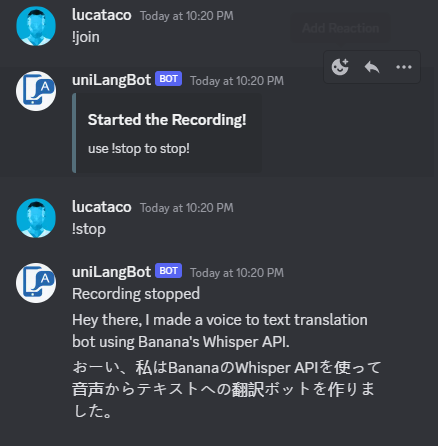

# Voice2Text Transate Discord Bot

This repo is an attempt to create a translator assistant discord bot that can listen to you in a voice channel, and provide almost real-time text translations.

# Quickstart

-Install python requirements

-Install ffmpeg

-Set Environment variables

-Run bot script

# Setup

Install python requirements

`pip install -r requirements.txt`

Install ffmpeg

`sudo apt install ffmpeg`

`python bot.py`

Set Environment variables

Copy .env.sample to .env and fill in your keys:

`BANANA_API_KEY=<>`

`BANANA_MODEL_KEY=<>`

`OPENAI_API_KEY=<>`

`DISCORD_TOKEN=<>`

Finally run the bot script

`python bot.py`

# Notes

Once you are in a voice channel, open the respective chat window and run `!join` to have the voice2text bot join. It will then start recording. Once you enter `!stop` it will start translating your speech to Japanese (as default).
